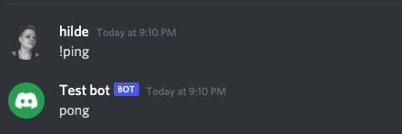

# A simple Discord bot written in JavaScript

This is just a simple Discord bot to demonstrate some of my coding style.

> NOTE: Uses discord.js v. 12.5.3, because I didn't have to time to learn all the changes for v. 13.

## Setup a new bot in discord

- Add new application at [https://discordapp.com/developers/applications/](https://discordapp.com/developers/applications/)
- Add bot for your application
- Reveal and copy the token to add to the .env file ([Se more under First time setup](#first-time-setup))
- Give "Privileged Gateway Intents" if you e.g want to use `presenceUpdate`
- Invite the bot to your server by going to `https://discordapp.com/oauth2/authorize?client_id=<CLIENT_ID>&scope=bot`. CLIENT_ID is found under OAuth2 for your application

## Local development

- `$ npm i`
- `$ node .`
- `$ npm test` to test run tests
- `$ npm run lint` to run eslint

### Or use Docker

`docker-compose up` or `docker-compose run app sh` to start the container and exec into sh so that the you can run `npm start` inside the container or eg. `npm install..`

### First time setup

- Create a `.env` file and copy the content from the `.env.sample` file
- Add the token from your bot
- Add a channel id for an info channel (this is just done to have a playground to send various messages to)

## Functionality

At the moment all the bot does is answer with "pong" if someone writes !ping.

